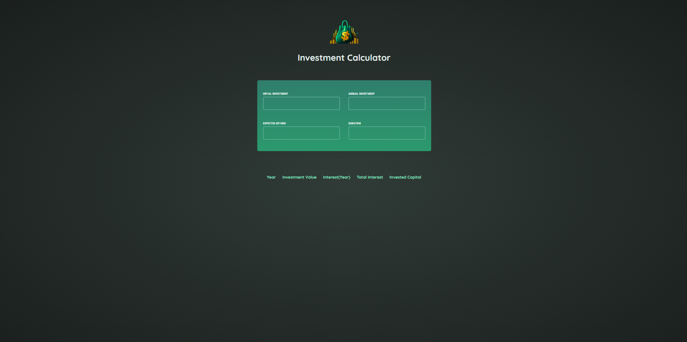
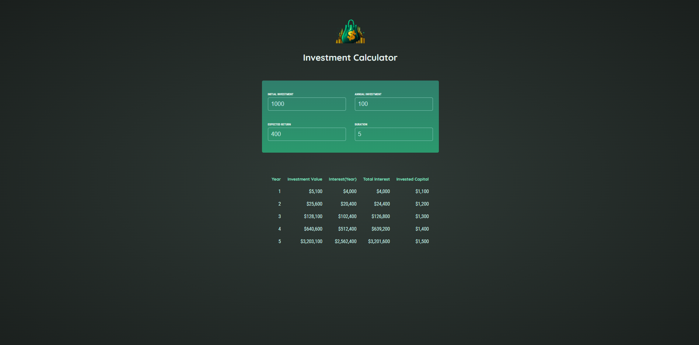

<div align="center">

# Investment Calculator

Take control of your financial future with vite-investment-calculator - a powerful tool for calculating potential investment returns. Built with Vite and React, this easy-to-use calculator can help you make informed investment decisions and track your progress towards your financial goals.

</div>

---

## 🚀 Live Demo

**Live Preview** ➡️ [Demo](#)

---

## 🛠️ Installation Steps

Follow the steps below to set up the project:

1. **Clone the repository**

```
git clone https://github.com/AMaroto98/InvestmentCalculator.git
```

2. **Install dependencies**

```
cd InvestmentCalculator
npm install
```

3. **Start the server**

```
npm run dev
```

Once the server is up and running, you can access the Investment Calculator application in your web browser.

---

## 💻 Tech Stack


---

## 🖼️ Project Screenshots

Explore the Investment Calculator project with these captivating screenshots, highlighting its sleek and user-friendly interface.





---

<div align="center">
Made with ❤️ by AMaroto98.
</div>
